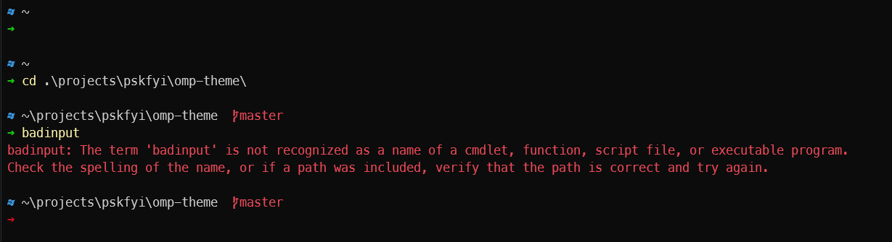
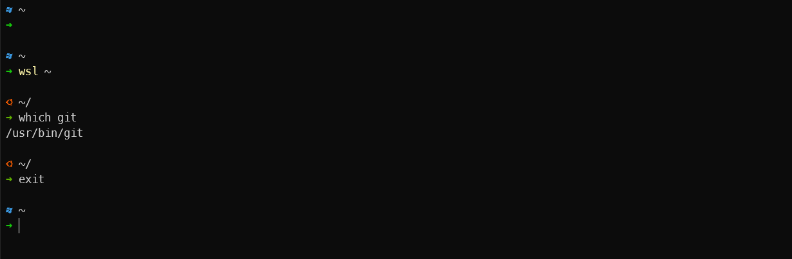

# `pskfyi.omp.json`

Minimal, spacious [`oh-my-posh`](https://ohmyposh.dev) theme based on the built-in theme ['wopian'](https://ohmyposh.dev/docs/themes#wopian).

With Windows Powershell:

## Windows Subsystem for Linux

Combine w/ my [`zsh-theme`](https://github.com/pskfyi/zsh-theme) for a similar look and feel in WSL Ubuntu.

## Acknowledgements

Thanks to [`oh-my-posh`](https://ohmyposh.dev) for the wonderful docs. It was everything I needed.

Thanks to [NerdFonts](https://www.nerdfonts.com/) for making everything fancy.
